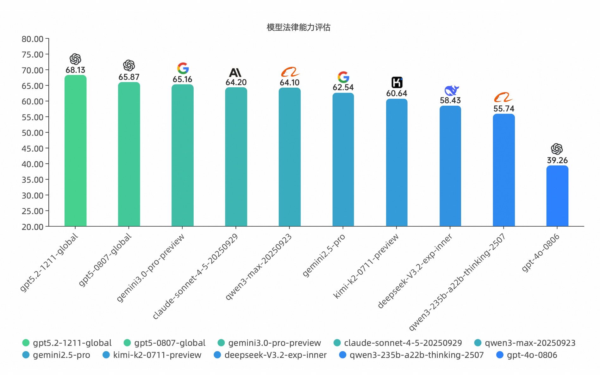

# PLawbench

# Introduction
PLawBench is a rubric-based benchmark designed to evaluate the performance of large language models (LLMs) in legal practice. It includes three legal tasks: legal consultation, case analysis, and legal document drafting, covering a wide range of real-world legal domains such as personal affairs, marriage and family law, intellectual property, and criminal litigation. The benchmark aims to evaluate LLMs’ practical capabilities in handling practical legal tasks.

1. In the public legal consultation task, we draw on situations commonly encountered by lawyers to simulate the interaction between clients and lawyers. This task tests whether the model can correctly understand users’ legal needs, thereby identifying and eliciting key facts that remain undisclosed by the parties.
   
2. In the case analysis task, each case is structured into four parts: conclusion, legal facts, reasoning, and legal provisions, with dedicated rubrics designed for each. For selected questions, we further specify particular legal reasoning paths to assess the model’s ability to conduct structured and sound legal reasoning in real-world cases.
   
3. In the legal document drafting task,  models are required to generate legal documents, such as complaints and statements of defense, based on provided scenarios. This task aims to evaluate the models' proficiency in professional legal writing.

Dataset Description:

案例分析例题250道.jsonl consists of case analysis questions. We have open-sourced a total of 250 questions, including the questions, reference answers, scoring rubrics, and score sheets. 

法律咨询例题18道.json consists of legal consultation questions. We have open-sourced a total of 18 questions, including the consultation scenarios and scoring rubrics.

答辩状例题.json and 起诉状例题.json are legal writing tasks for drafting statements of defense and complaints, respectively. We have open-sourced a total of 12 questions in total, including the writing scenarios and scoring rubrics.

# Contributions
Our work makes three main contributions:

1.More realistic simulation of legal practice:We faithfully simulate real-world legal practice scenarios, with all tasks adapted from authentic cases. The benchmark organizes legal tasks into three hierarchical levels—public legal consultation, practical case analysis, and legal document generation—reflecting the full workflow of legal practi- tioners and enabling a comprehensive evaluation of LLM performance across diverse legal tasks. 

In real legal practice, user queries are often vague, logically inconsistent, emotionally charged, or even intentionally incomplete. While preserving the core logic of real cases, we deliberately amplify these cognitively challenging elements—such as ambiguous descriptions, omitted key facts, and misleading details—to assess whether LLMs can effectively operate under realistic legal consultation conditions.

2.Fine-Grained Reasoning Steps:Beyond evaluating final outcomes, our benchmark explicitly incorporates fine-grained legal reasoning steps into task design and evaluation. This allows us to examine whether LLMs can perform multi-stage legal reasoning, including issue identification, fact clarification, legal analysis, and conclusion validation,rather than relying on shallow pattern matching or surface-level reasoning.

3.Task-Specific Rubrics:Our evaluation framework adopts personalized, task-specific rubrics annotated by legal experts, moving beyond purely outcome-based or form-based metrics to assess substantive legal reasoning and decision-making processes.For each type of legal task, legal experts first define a rubric framework tailored to the task’s reasoning requirements. Subsequently, they annotate case-specific rubrics for each individual legal scenario. This two-stage annotation process ensures that evaluation criteria are both principled and context-sensitive, enabling a more fine-grained,comprehensive, and realistic assessment of LLM performance in legal practice settings.

# ranking
|Models                              |Scoring Rate|
|------------------------------------|------------|
| GPT5.2-1211-global                 | 68.13      |
| GPT5-0807-global                   | 65.87      |
| gemini3.0-pro-preview              | 65.16      |
| claude-sonnet-4-5-20250929         | 64.20      |
| Qwen3-max-20250923                 | 64.10      |
| Gemini2.5-Pro-0617                 | 62.54      |
| kimi-k2-0711-preview               | 60.64      |
| DeepSeek-V3.2 -exp-inner           | 58.43      |
| Qwen3-235b-a22b-thinking-2507      | 55.74      |
| GPT-4o-0806                        | 39.26      |

